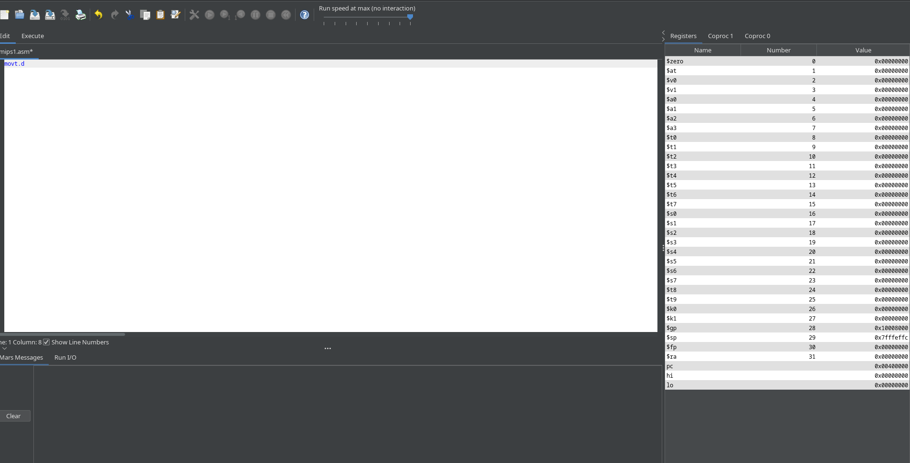

# MARS

MARS (official) MIPS Assembler and Runtime Simulator

 MARS is a lightweight interactive development environment (IDE) for programming in MIPS assembly language, intended for educational-level use with Patterson and Hennessy's Computer Organization and Design.

 It is available for you to download as an executable JAR file.  Click the MARS v.4.5 link at right, under Releases, to access the download.

 We have relocated the MARS website to  https://dpetersanderson.github.io/    There are still a couple of display issues to work out but all website content is there.  This includes all documentation and the JAR download.  We are not experienced in github so if you know a way we can host the website in this MARS repository let us know.

 This is the original MARS, developed by Pete Sanderson and Ken Vollmar.  Developed while Pete was professor at Otterbein University and Ken was professor at Missouri State University.  Both are now retired. This is a legacy application but is very stable and continues to be used by universities throughout the world as of 2024. The last release was MARS 4.5 in August 2014.

 Until October 2024 the MARS website, including executable JAR file download, was hosted by Missouri State University. That is no longer the case. That's why it is here.

> [!WARNING]
> This is my community maintained fork version 4.6 that merges useful PRs into the project for my personal use.
> You can use it if you want, but I'm not gonna maintain it much, so use it at your own risks.

## Features
This fork includes [Flatlaf](https://www.formdev.com/flatlaf/) to allow for:
- Partial dark mode support
- Native window decorations
- High DPI displays
- Optionally, Intellij theme support
- And more...

## Merged PRs and fixed issues
- https://github.com/dpetersanderson/MARS/pull/10
- https://github.com/dpetersanderson/MARS/pull/4
- https://github.com/dpetersanderson/MARS/issues/11

## Screenshot

## How to run
- Install Java 11+ on your system
- On Linux/Mac, either use `./gradlew build` with `java -jar build/libs/Mars-4.6.jar` or `./gradlew run`
- On Windows, either use `./gradlew.bat build` with `java -jar build/libs/Mars-4.6.jar` or `./gradlew.bat run`
